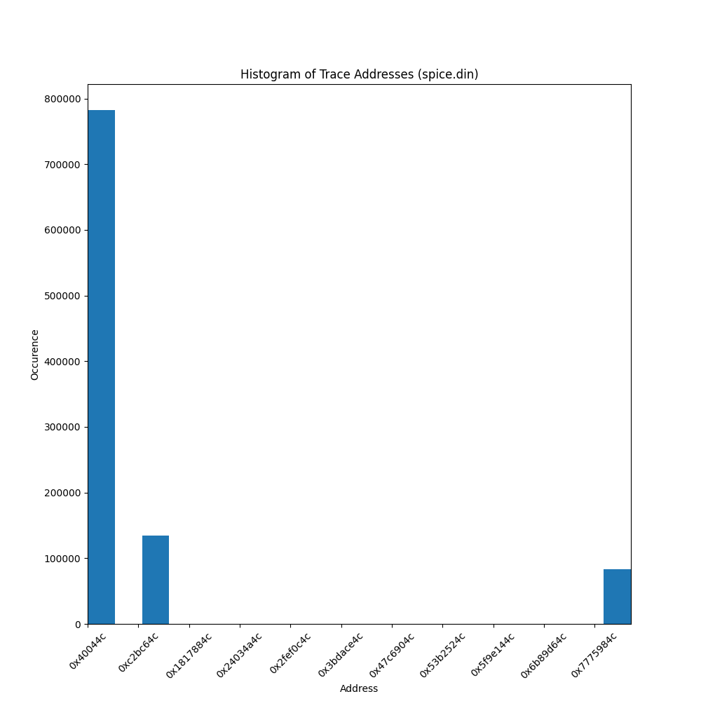
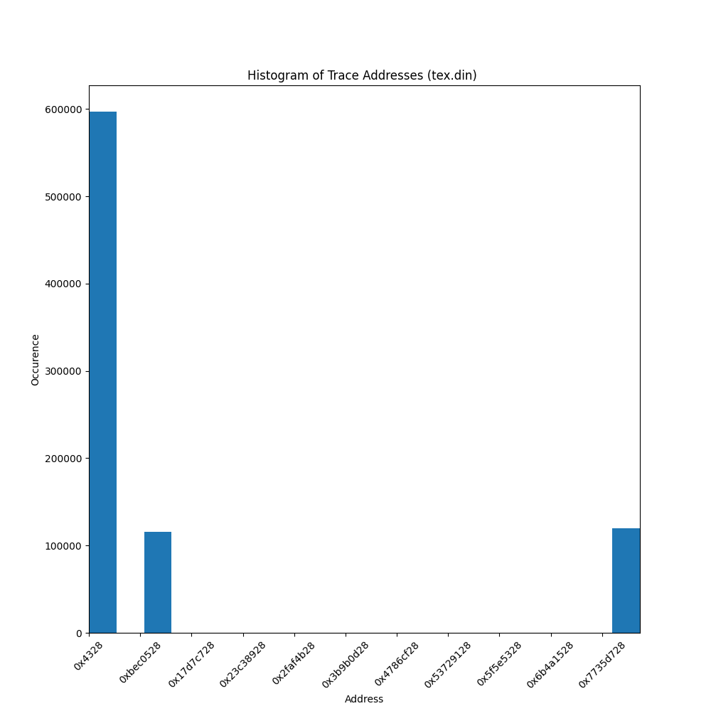
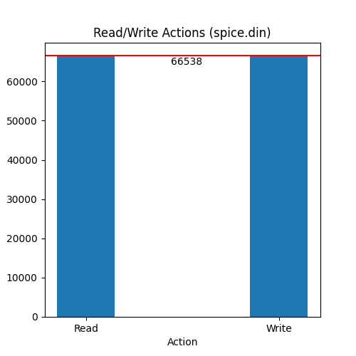
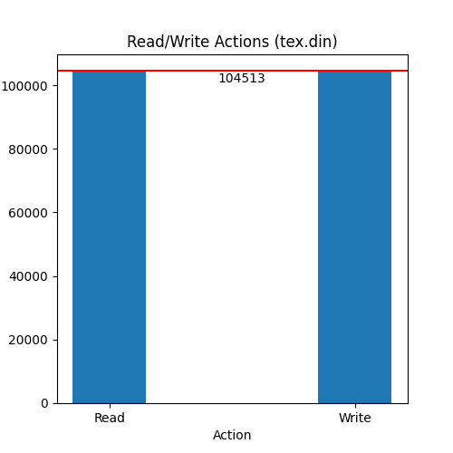

# CS402

### 1 (a) Using trace files, i.e. files that contain addresses issued by some CPU to execute some application(s), draw the histogram of address distribution for each of them (2x20 points). On the Ox axis of the plot you will have the address number (don't start with zero, rather with the smallest address you find in the file and go up to the maximum address in the file). On the Oy axis you will have the number of occurrences for each particular address. 

### Comment based on the histograms (5). 
It is interesting that the histograms look similiar even though they are different programs. I believe this is the case because grouping addresses together allows for a speed up in execution. I'm not sure why both programs have a large gap in memory addresses.

### (b) What is the frequency of writes (5)? What is the frequency of reads (5)? Please comment on these results (5). 

The spice.din file has 66538 reads and writes. The tex.din file has 104513 reads and writes. I did not think that the read and write actions would be equal in both files. Prior to this I thought there would be more read operations than write operations.

### 2. (a) Write a program, using your favorite programming language, that multiplies two rectangular matrices -- please no square matrices -- whose elements are randomly generated. You will have two versions of the program, one in which matrix elements are integers and another one where they are real numbers (double) (2x15 points). 

 

Check out the [python script](scripts/matrix.py). I continued this script to include a new multiplication method to satisy the requirements for Question 2 of this homework. 

 

### Measure the time it takes each program to complete (2x5) and then compare the performance of the two systems (5). Since the matrices are randomly generated, you will have to run the program several times, measure the running time and then take the average. Also the running time has to be significantly large (many seconds) to avoid measuring errors; this means you will have to work with matrices that have at least hundreds of lines and columns.  

 

#### **Integer Matrix Table (Computer 1)**

| Trial | Runtime (seconds)       
| ----|-------------:
| 1| 48.50329279899597 
| 2| 49.07158398628235       
| 3| 56.26367497444153
| 4| 46.05574727058411
| 5| 45.77602243423462
|**Average**| **49.1340642929077**

 

#### **Double Float Matrix Table (Computer 1)**

| Trial | Runtime (seconds)       
| ----|-------------:
| 1| 48.60213255882263 
| 2| 48.30789113044739       
| 3| 47.89726066589356
| 4| 47.64024353027344
| 5| 47.01181340217590
|**Average**| **47.8918682575226**

 
 

#### **Integer Matrix Table (Computer 2)**

| Trial | Runtime (seconds)       
| ----|-------------:
| 1|  59.3837523460388
| 2|  59.4720880985260    
| 3|  60.5311424732208
| 4|  58.5471210479736
| 5|  59.4799921512604
|**Average**| **59.4828192234039**

 

#### **Double Float Matrix Table (Computer 2)**

| Trial | Runtime (seconds)       
| ----|-------------:
| 1|  53.35340619087219
| 2|  51.17388725280762      
| 3|  51.29845762252808
| 4|  50.91303920745850
| 5|  53.61081385612488
|**Average**| **52.0699208259583**

 
 

#### **Performance Comparison**

| Matrix Type| Average PC 1 runtime (seconds)| Average PC 2 runtime (seconds)| Delta (seconds)|
|--------|:--------:|:--------:|:----:|
|Integer| 49.134 | 59.483 | 10.349
|Double Float| 47.892| 52.070| 4.178

Comparing the two machines; PC 1 ran faster in both integer matrix multiplication (1.21 times faster) and double float matrix multiplication (1.09 times faster). 
 
 
I found it interesting that double float matrix multiplication was a faster operation on both machines compared to integer matrix multiplication. Prior to measuring the results I thought it would be the reverse. Some quick post-experiment research indicates this is a Python quirk that many people have experienced.

 

### Is the performance ratio the same as the clock rate ratio of the two systems (5)? Explain. Based on the retail price of the two systems, which one is more cost effective (5)? 
 
The performance ratio, briefly mentioned above, is simply the time for one pc to execute a program divided by the time for a second pc to run the same program. Using the data above the performace ratio between PC 1 and PC 2 is 1.21 for the integer matrix and 1.09 for the double float matrix. 
 
 
However, the clock rate ratio is considered static for both programs. This would be the clock rate of PC 1 divided by the clock rate of PC 2. The clock rate for PC 1 is 1.9 Ghz and the clock rate for PC 2 is 1.3 Ghz. Therefore, the clock rate ratio is 1.46 (1.9 Ghz/1.3Ghz).
 
 
The performance ratio does not match the clock rate ratio because there are more factors to take into consideration when measuring performance. Primarily, the clock cycles per instruction (CPI). This factor is dependent on the CPU's architecture and the compiler used. 
 
 
The price for PC 1 (make, model) is $XXXXX and the price for PC 2 (make, model) is $XXXXX. Using the performance ratio we found above we would place the price of PC 1 between $XXXX-$XXXX. Since that is not the case, if you were to judge these two PCs based soley on compute power, PC 2 would be the better choice.
 
 

###  (b) Change your multiplication algorithm and repeat the steps above; for instance, if you used the the naive multiplication algorith with the column in the inner loop, then just use the same algorithm with the row in the inner loop (same scoring as part a).
 
 

Check out the [python script](scripts/matrix.py). I continued this script to include a new multiplication method to satisy the requirements for Question 2 of this homework. 

 
 

### Make sure your work includes a description of the two systems (manufacturer, CPU type, amount of memory, operating system, etc.) and of the compiler used (5). Attach the source code, the tables with your time measurements for your work, and a link to your repository such that we can check-out the code, build, and execute (5). 

 
 

All my data and scripts are included in this zip. You can check out the repository at https://github.com/cjlongoria/CS402_HW1